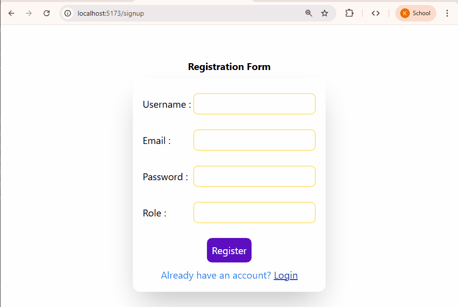

# Login-Authentication-using-Nodejs
This project uses React private routing, encrypting of password before storing on database.used other libraries like toastify.Dealt with jwt tokens,and how they are used in real life for authentication process.This is a great to learn concepts how authentication works in real life.

In this project I have used private routing, means if I try to change page by changing url, user won't be able to do it.If user is login and is wants to navigate to /signup page he/she will not to able to do this unless they logged out.Similarly if user is not logged in and wishes  to move to mainn page that is /home. He won't bbe allowed to do so.
You can also check the local storage where somme credentials of user are stored on when user logs in and is removed from local storage when they logged out

